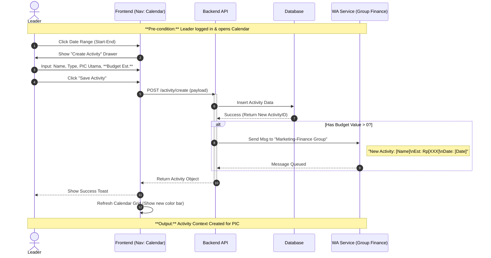
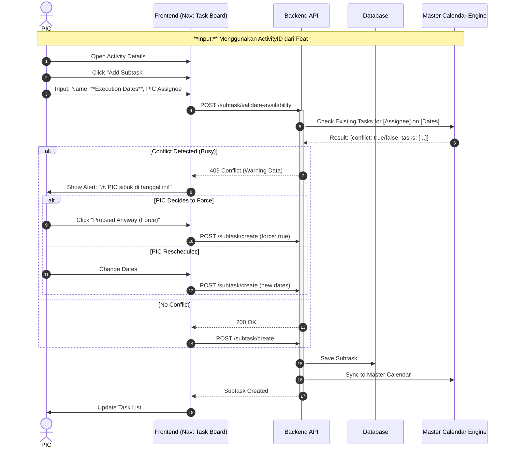
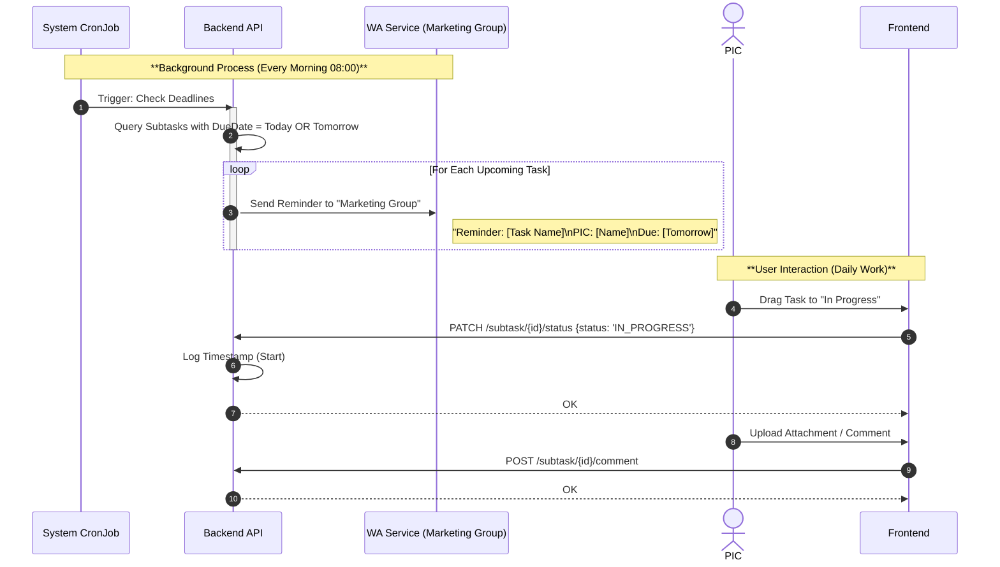
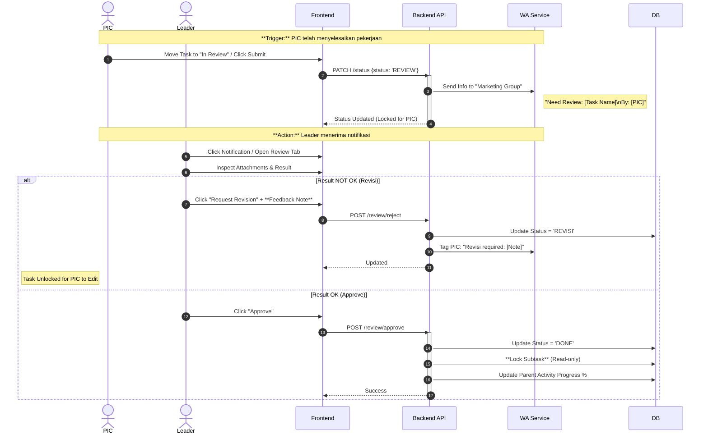

# Marketing Board - Detailed Sequence Diagrams

Dokumen ini memecah alur sistem menjadi 4 diagram sekuensial yang saling berkesinambungan. Setiap diagram merepresentasikan satu **Unit Fitur Utama** dari lifecycle pekerjaan tim marketing.

---

## 🔗 Overview Kesinambungan
1.  **Activity Planning:** Leader membuat "Wadah" (Activity) → Output: `ActivityID`.
2.  **Subtask Planning:** PIC mengisi wadah tersebut dengan "Isi" (Subtask) → Memerlukan `ActivityID`.
3.  **Execution & Monitoring:** PIC mengerjakan task + Sistem mengirim Reminder.
4.  **Review Loop:** Validasi hasil kerja sebelum ditutup.

---

## 1. Feature: Activity Planning (Leader Context)
*Goal: Leader menetapkan timeline besar dan konteks pekerjaan. Jika menggunakan budget, Finance langsung diberitahu.*

---

## 2. Feature: Subtask Planning & Anti-Block System (PIC Context)
*Goal: PIC memecah Activity menjadi tugas harian. Sistem mencegah bentrok jadwal dengan "Anti-Block Alert".*

---

## 3. Feature: Daily Execution & Automated Reminders
*Goal: Monitoring harian dan reminder otomatis agar tidak ada yang terlewat.*

---

## 4. Feature: Review & Approval Loop
*Goal: Quality Control. Task tidak bisa "Done" tanpa persetujuan Leader.*

