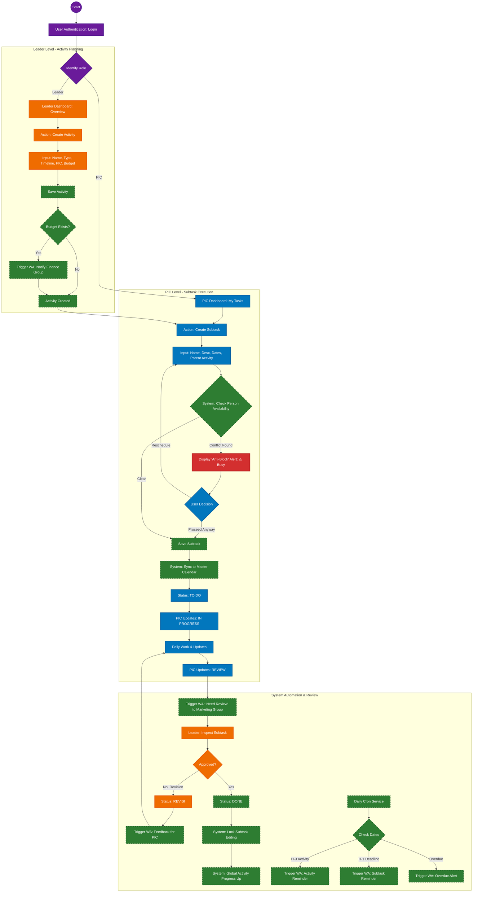

# Marketing Board - Activity & Subtask Flow Documentation

Dokumen ini berisi alur kerja sistem berdasarkan `marketing fix.md`, dibagi menjadi dua perspektif:
1.  **Technical Flow:** Logic sistem, validasi anti-bentrok, dan integrasi WhatsApp.
2.  **Team Presentation Flow:** User journey untuk presentasi ke tim (Leader & PIC).

---

## 1. Technical Implementation Flow (For Developers)
*Focus: Data logic, system states, "Anti-Block" checks, WhatsApp Triggers.*

---

## 2. Team Presentation Flow (User Journey)
*Focus: Detailed User Journey displaying the collaboration between Leader and PIC.*

```mermaid
flowchart TD
    %% Visual Palette for Presentation
    classDef userAction fill:#E3F2FD,stroke:#1565C0,color:#000,rx:5,ry:5;
    classDef systemResp fill:#E8F5E9,stroke:#2E7D32,color:#000,rx:5,ry:5;
    classDef decisionPoint fill:#FFF3E0,stroke:#EF6C00,color:#000;
    classDef waNotif fill:#25D366,stroke:#075E54,color:#fff,stroke-width:2px;
    classDef navNode fill:#424242,stroke:#000,color:#fff,rx:0,ry:0;

    %% Header
    subgraph Phase_1 [Phase 1: Planning Leader]
        direction TB
        L1(Leader Opens App) --> LN1[Nav: Calendar Menu]:::navNode
        LN1 --> L2(Click Date & Create 'Activity')
        L2 --> L3{Budget Needed?}
        L3 -- Yes --> S1[System: Notifies Finance Group via WA]
        L3 -- No --> L4(Activity Saved on Calendar)
    end

    subgraph Phase_2 [Phase 2: Execution PIC]
        direction TB
        P1(PIC Checks Calendar Assignment) --> PN1[Nav: Task Board Menu]:::navNode
        PN1 --> P2(Find Activity Group & Add 'Subtasks')
        P2 --> P3(Sets Dates & Deadlines)
        P3 --> S2{System: Conflict Check}
        S2 -- ⚠️ Clash --> P4(PIC sees Warning but decides to Proceed)
        S2 -- ✅ Clear --> P5(Subtask Created)
        P4 --> P5
        
        P5 --> S3[System: Syncs to Master Calendar]
        S3 --> P6(PIC Works: Updates Status to 'In Progress')
    end

    subgraph Phase_3 [Phase 3: Review & Completion]
        direction TB
        P7(PIC finishes work) --> P8(Changes Status to 'Review')
        P8 --> W1>📲 WA Notification: Task Needs Review]:::waNotif
        
        W1 --> L5(Leader Checks Details)
        L5 --> L6{Is Result OK?}
        
        L6 -- "No (Revisi)" --> P9(Status: Revisi + Feedback)
        P9 --> P6
        
        L6 -- "Yes (Approve)" --> S4(Status: DONE)
        S4 --> S5[System: Locks Task & Updates Progress]
    end

    %% Connections
    L4 --> P1
    P6 --> P7
    S1 --> L4

    %% Styling
    class L1,L2,L4,L5,P1,P2,P3,P4,P5,P6,P7,P8,P9 userAction;
    class S1,S3,S4,S5,S2 systemResp;
    class L3,L6 decisionPoint;
```

