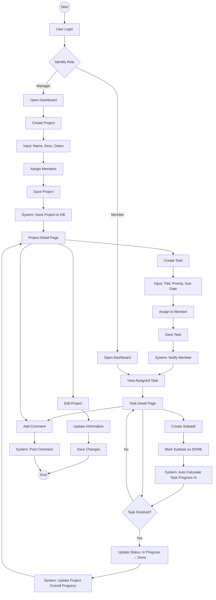

# Marketing Board - User Flow (Flowchart Style)

This document visualizes the user journey for Manager and Member roles in a flowchart format.

```text
[ START ]
    │
    ▼
1. LOGIN PAGE 🔐
    │
    ├─ User enters Email & Password
    ├─ System Validates Credentials
    │
    ▼
2. DASHBOARD 📊
    │
    │  (Role: Manager 🛡️ & Member 👤)
    │
    ├── [Manager Action] ──────────────────────────────┐
    │  Clicks "Create Project"                         │
    │                                                  │
    ▼                                                  │
3. CREATE PROJECT 📝                                   │
    │                                                  │
    ├─ Input: Project Name, Desc, Dates                │
    ├─ Action: Assign Members                          │
    ├─ Click Save                                      │
    │                                                  │
    ▼                                                  │
4. PROJECT DETAIL 📁                                   │
    │                                                  │
    ├─ View: Project Info & Member List                │
    │                                                  │
    ▼                                                  │
   [Manager Action]                                    │
   Clicks "Add Task"                                   │
    │                                                  │
    ▼                                                  │
5. CREATE TASK ✅                                      │
    │                                                  │
    ├─ Input: Title, Priority, Due Date                │
    ├─ Action: Assign to "Member A"                    │
    ├─ Click Save                                      │
    │                                                  │
    │                                                  ▼
    └──────────────────────────────────────────> [ System Updates DB ]
                                                       │
                                                       ▼
                                                (Member A Logs in)
                                                       │
                                                       ▼
                                            6. TASK DETAIL 📋
                                                       │
                                                       ├─ View: Assigned Task Info
                                                       │
                                                       ▼
                                                  [Member Action]
                                                Clicks "Add Subtask"
                                                       │
                                                       ▼
                                            7. CREATE SUBTASK 🔨
                                                       │
                                                       ├─ Input: "Draft Content"
                                                       ├─ Click Save
                                                       │
                                                       ▼
                                                  [Member Action]
                                               Mark Subtask as DONE
                                                       │
                                                       ▼
                                             (System Auto-Updates %)
                                                       │
                                                       ▼
                                            8. UPDATE TASK STATUS 🔄
                                                       │
                                                       ├─ Status: To Do -> In Progress
                                                       ├─ Status: In Progress -> Done
                                                       │
                                                       ▼
                                           (Project Progress Increases)
                                                       │
                                                       ▼
                                            9. ADD COMMENT 💬
                                                       │
                                                       ├─ Manager: "Please align assets"
                                                       ├─ Member: "Done uploaded"
                                                       │
                                                       ▼
                                           10. EDIT PROJECT ✏️
                                                       │
                                                       ├─ Manager notices details need update
                                                       ├─ Click "Edit Project"
                                                       ├─ Update & Save
                                                       │
                                                       ▼
                                                    [ END ]
```

## Mermaid Diagram Representation


