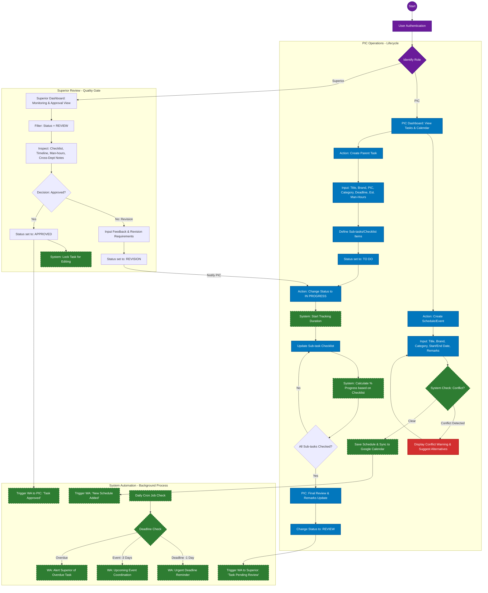
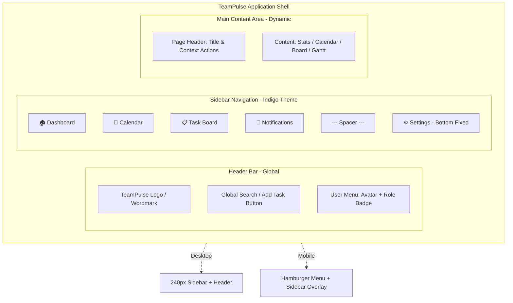

# Marketing Board - User Flow Documentation

Dokumen ini berisi dua versi alur kerja sistem:
1. **Technical Flow:** Untuk referensi tim developer/IT (Detail Teknis).
2. **Team Presentation Flow:** Alur detail untuk presentasi user, dengan pewarnaan yang konsisten.

---

## 1. Technical Implementation Flow (For Developers)
*Focus: Data logic, system states, background services, APIs.*

---

## 2. Team Presentation Flow (User Journey)
*Focus: Detailed User Journey with Clear Roles & Quality Gates.*

